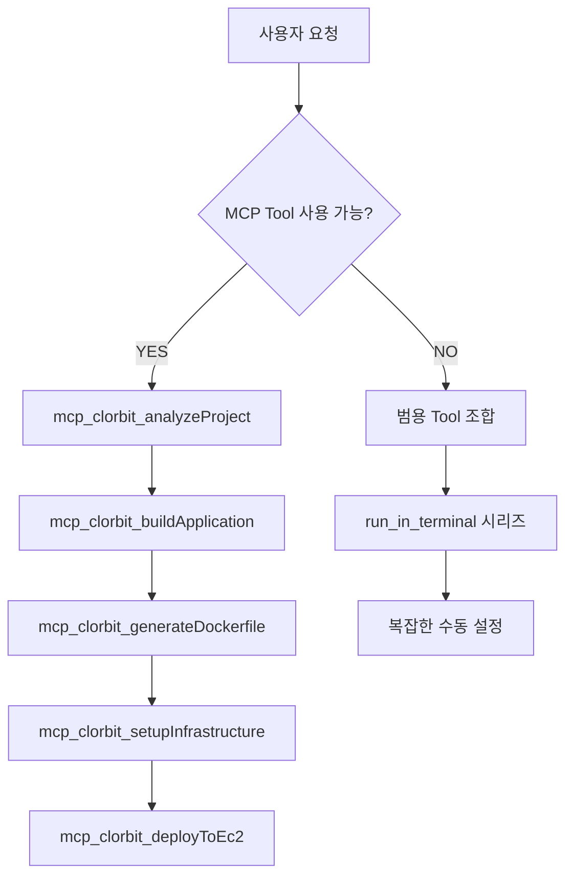

# MCP 하이브리드 아키텍처 제안

## 🎯 목표
- **안정성**: 핵심 배포 로직은 검증된 MCP Tool 사용
- **유연성**: 예외 상황은 범용 Tool로 대응
- **사용성**: 배포 초보자도 쉽게 사용 가능

## 🏗️ 제안 구조

### 1단계: 핵심 배포 MCP Tools
```typescript
// 프로젝트 분석 및 빌드
mcp_clorbit_analyzeProject()      // 프로젝트 타입, 빌드 도구 감지
mcp_clorbit_buildApplication()    // Spring Boot 빌드 (Gradle/Maven 자동 감지)
mcp_clorbit_generateDockerfile()  // 프로젝트에 맞는 Dockerfile 생성

// AWS 인프라 관리
mcp_clorbit_setupInfrastructure() // Security Group, KeyPair 등 인프라 설정
mcp_clorbit_deployToEc2()         // EC2 인스턴스 생성 및 배포
mcp_clorbit_cleanup()             // 리소스 정리
```

### 2단계: 범용 Tools (Fallback)
```typescript
// 예외 상황 처리
run_in_terminal()        // 특수한 명령어 실행
create_file()           // 설정 파일 생성
replace_string_in_file() // 파일 수정
```

## 🔄 실행 흐름

### 사용자 명령: "스프링부트를 AWS에 배포해줘"



## 💡 핵심 MCP Tools 설계

### mcp_clorbit_analyzeProject()
```json
{
  "input": "프로젝트 경로",
  "output": {
    "projectType": "spring-boot",
    "buildTool": "maven|gradle",
    "javaVersion": "17",
    "dependencies": ["web", "actuator"],
    "recommendedDockerfile": "multi-stage"
  }
}
```

### mcp_clorbit_buildApplication()
```json
{
  "input": {
    "buildTool": "maven",
    "skipTests": true
  },
  "output": {
    "jarFile": "target/app.jar",
    "buildSuccess": true,
    "buildTime": "45s"
  }
}
```

### mcp_clorbit_deployToEc2()
```json
{
  "input": {
    "dockerImage": "spring-boot-app:latest",
    "instanceType": "t2.micro",
    "region": "ap-northeast-2"
  },
  "output": {
    "instanceId": "i-1234567890abcdef0",
    "publicIp": "52.78.123.45",
    "deploymentUrl": "http://52.78.123.45:8080"
  }
}
```

## 🎯 사용자 경험 개선

### Before (현재)
```
사용자: "배포해줘"
AI: "Gradle 설치하겠습니다... Maven으로 변경하겠습니다... 
     Dockerfile 수정하겠습니다... Docker 빌드하겠습니다..."
(20+ 개별 단계)
```

### After (제안)
```
사용자: "배포해줘"
AI: "프로젝트 분석 완료 → Spring Boot Maven 감지
     빌드 완료 → JAR 파일 생성
     Docker 이미지 생성 완료
     AWS 인프라 설정 완료
     EC2 배포 완료 → http://52.78.123.45:8080"
(4개 핵심 단계)
```

## 🛡️ 안정성 보장

### Error Handling
```typescript
if (mcp_clorbit_buildApplication.failed) {
  // Fallback to manual build
  run_in_terminal("mvn clean package")
}

if (mcp_clorbit_deployToEc2.failed) {
  // Provide manual deployment guide
  create_file("manual-deploy.sh", deployScript)
}
```

### Validation
```typescript
// 각 MCP Tool은 선행 조건 검증
mcp_clorbit_deployToEc2({
  prerequisites: {
    dockerImage: "required",
    awsCredentials: "required",
    securityGroup: "auto-create"
  }
})
```

## 📊 초보자 친화성

### 단순한 명령어
```bash
# 사용자가 할 일
"스프링부트 프로젝트를 AWS에 배포해줘"

# AI가 자동으로 처리
✅ 프로젝트 타입 감지
✅ 빌드 도구 선택
✅ Docker 이미지 생성
✅ AWS 리소스 생성
✅ 배포 완료
✅ 접속 URL 제공
```

### 자동화된 설정
```typescript
// 사용자는 AWS 키만 제공하면 됨
mcp_clorbit_setupInfrastructure({
  autoCreate: {
    securityGroup: true,    // 자동 생성
    keyPair: true,         // 자동 생성
    subnet: "default",     // 기본값 사용
    instanceType: "t2.micro" // 프리티어
  }
})
```
